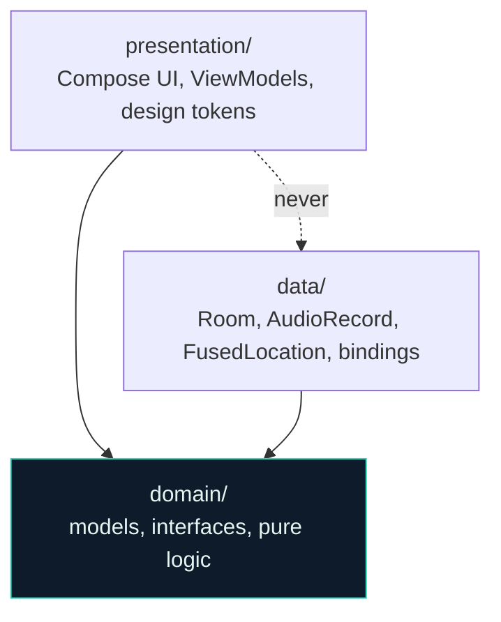
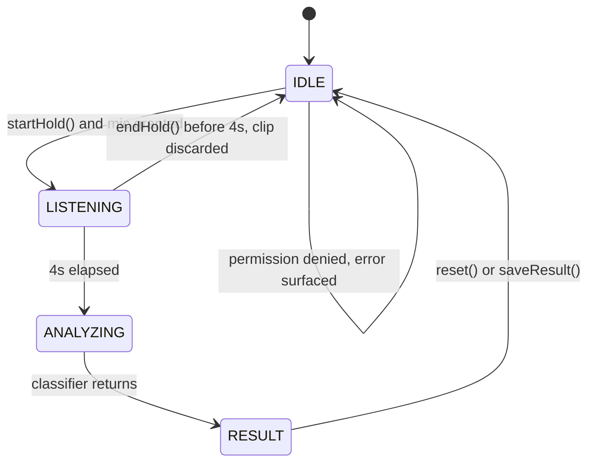

# MozzID Architecture

Technical reference for the Kotlin/Android implementation. For exact design
tokens, screen geometry, and porting detail from the original Flutter build, see
[`PORTING_SPEC.md`](PORTING_SPEC.md). For build commands and environment traps,
see [`CLAUDE.md`](CLAUDE.md).

Single Gradle module (`:app`), 50 Kotlin source files, ~5.5k lines, 14 unit
tests. Android only, Kotlin only, no cross-platform layer.

---

## 1. Constraints that shape the design

Three constraints drive every structural decision below. They are worth stating
first because most of the architecture is downstream of them.

**Offline-first is structural, not aspirational.** There is no required backend.
The app must install and run to full functionality with no network, no account,
and no `google-services.json`. This is enforced by making the no-op sync binding
the default rather than by convention.

**The ML model is deferred.** Wingbeat classification runs behind an interface
returning a mock. Everything upstream of that interface — capture, timing,
result presentation, persistence — is finished and testable today, and the real
model drops in without touching a screen.

**Risk information must survive colour blindness.** Severity is always encoded
three ways simultaneously (glyph, text label, colour). No code path may signal
risk by colour alone.

---

## 2. Layer topology

Three layers in one module, separated by package with an enforced dependency
rule.



`domain/` depends on nothing but the Kotlin stdlib and `kotlinx.coroutines`.
`presentation/` and `data/` both depend on `domain/` and never on each other.

### The purity rule

`domain/` must contain no Android, Compose, or Play Services imports. This is
mechanically checkable, so verify after touching it:

```bash
grep -rn "^import android\|^import androidx\|^import com.google" \
  app/src/main/kotlin/com/mozzid/domain/
```

`kotlinx.coroutines`, including `Flow`, **is** permitted — it is pure Kotlin, not
an Android dependency. Repository interfaces return `Flow` directly.

Two consequences worth knowing before reading the models:

- `Severity` and `Species` carry colours as ARGB `Long`, not Compose `Color`.
  `presentation/theme/SeverityColors.kt` converts them and derives the
  background/border/icon tints.
- `AppSettings.accentId` is a `String`, not the `AppAccent` enum, because that
  enum lives in `presentation/`. `AppAccent.fromName()` resolves it and falls
  back to the default for anything unrecognised.

---

## 3. Composition root

`Bootstrap` is the only place implementations are selected. Swapping any
dependency is a one-line change there.

```kotlin
Bootstrap(
    database            = db,
    detectionRepository = RoomDetectionRepository(db.detectionDao()),
    speciesRepository   = species,
    settingsRepository  = RoomSettingsRepository(db.settingsDao()),
    classifier          = classifier,          // MockSpeciesClassifier today
    audioRecorder       = MicAudioRecorder(app, permissions),
    location            = FusedLocationService(app, permissions),
    sync                = NoopSyncService,     // default binding, stays default
    permissions         = permissions,
)
```

`Bootstrap.create()` is a `suspend` function — it opens the Room database and
runs `DemoSeeder`. It is currently assembled in `MainActivity` via
`produceState`, not in `MozzApplication`.

> **Trap.** `MozzApplication` holds a `CompletableDeferred<Bootstrap>` that
> nothing ever completes. Awaiting it hangs forever. Complete it in `onCreate`
> or delete it before adding a second entry point.

There is no DI framework. With one composition root and a fixed object graph,
Hilt would add build-time cost and indirection without removing any wiring.

---

## 4. The two seams

These are the only boundaries between the app and anything replaceable.

### ML seam — `SpeciesClassifier`

```kotlin
interface SpeciesClassifier {
    suspend fun load()
    suspend fun classify(sample: AudioSample): ClassificationResult
    suspend fun dispose()
}

data class AudioSample(
    val filePath: String,
    val durationMillis: Long,
    val sampleRate: Int = 44100,
)
```

`AudioSample` is deliberately the single input type so the eventual switch to
decoded PCM or a mel-spectrogram does not ripple outward.

`MockSpeciesClassifier` ignores the audio, delays 1700 ms to imitate on-device
inference, and returns a primary plus runner-up with 78–94% confidence and a
per-species wingbeat frequency drawn from that species' real range.

To land the real model: add `org.tensorflow:tensorflow-lite`, bundle weights and
labels in `assets/`, implement `TfliteSpeciesClassifier` (decode WAV → mel
spectrogram → CNN → top-2 → map labels through `SpeciesRepository`), and change
the one binding in `Bootstrap`. No UI or domain changes.

### Backend seam — `SyncService`

```kotlin
interface SyncService {
    val isEnabled: Boolean
    suspend fun pushDetection(detection: Detection)
    suspend fun pullAggregates()
}
```

`NoopSyncService` is a Kotlin `object` with `isEnabled = false` and empty bodies.
**It is the default binding and stays that way.** A `FirebaseSyncService` must
fall back to it when `google-services.json` is absent, so a fresh clone builds
and runs offline with no configuration.

Call sites treat sync as best-effort and never block on it:

```kotlin
runCatching { sync.pushDetection(saved) }
```

---

## 5. Device services

Both follow the same shape: interface in `domain/repository/Services.kt`,
Android implementation in `data/`.

### Audio capture

`MicAudioRecorder` writes **16-bit PCM WAV, 44.1 kHz, mono** via `AudioRecord`.
Uncompressed is deliberate: the deferred TFLite model can read clips with no
decode step. Buffer is `AudioRecord.getMinBufferSize() * 2`.

The writer coroutine leaves a 44-byte gap at the head of the file and streams PCM
after it; `stop()` seeks back with `RandomAccessFile` and patches the RIFF header
once the final length is known. Cache is pruned to `KEEP_RECENT_CLIPS = 3`.

Shutdown ordering matters and is easy to get wrong: flip the state flag to
STOPPED so the writer loop exits, `join()` it, and only then release the
`AudioRecord`. Releasing under an in-flight `read()` crashes natively.

### Location

`FusedLocationService` wraps `FusedLocationProviderClient` with
`PRIORITY_BALANCED_POWER_ACCURACY`, `FIX_TIMEOUT_MILLIS = 8_000`, and
`MAX_FIX_AGE_MILLIS = 60_000`.

**It is non-throwing by contract.** Denial, timeout, cancellation, and provider
failure all resolve to `null`. Losing coordinates is acceptable; losing the
detection because location failed is not.

---

## 6. Capture pipeline

`RecordViewModel` is the state machine. `CAPTURE_MILLIS = 4000`,
`TICK_MILLIS = 16` (~60 fps progress updates).



Three behaviours here are deliberate:

**Early release discards.** A short clip yields a confident-looking wrong answer,
so a partial capture is cancelled rather than classified.

**Saving is explicit.** `finishListening()` presents the result but does not
persist. `saveResult()` writes the row when the user taps Save. The GPS fix is
warmed in the background during the result screen so that tap is instant, and the
row stores `capturedAt` — when the clip was recorded — not when the user got
round to saving.

**Errors surface.** `RecordError.MIC_DENIED` and `FAILED` are rendered as a
toast and then cleared via `clearError()`. Without this, a refused microphone
makes the button appear inert.

---

## 7. Persistence

Room over `mozzid.db`, schema version 1, `exportSchema = false`. Two tables.

### `detections` — the offline source of truth

| Column | Type | Notes |
|---|---|---|
| `id` | INTEGER PK | autogenerated |
| `species_id` | TEXT | stable catalogue key |
| `confidence` | INTEGER | 0–100 |
| `wingbeat_hz` | INTEGER | measured fundamental |
| `timestamp` | INTEGER | epoch millis, capture time |
| `latitude` | REAL? | null when no fix |
| `longitude` | REAL? | null when no fix |
| `location_label` | TEXT? | optional place name |

Reads are `Flow`, ordered `timestamp DESC`, so History updates the moment a row
lands with no manual refresh path to go stale.

### `settings` — sparse key/value

```
key TEXT PRIMARY KEY, value TEXT
```

A key is written **only when it changes**; anything absent falls back to the
`AppSettings` data-class default. This is the whole point of the design: new
settings need no migration, because absence is already a defined state.
`RoomSettingsRepository` serialises read-modify-write through a `Mutex` and
persists only changed keys.

`DemoSeeder` inserts 6 Jakarta-area rows on first install so History, the map,
and the stats card have content before the first real capture.

---

## 8. Presentation

### Token system

`MozzColors.of(dark: Boolean, accent: AppAccent)` derives the full palette; it is
published through `LocalMozzColors`, a `staticCompositionLocalOf`. Four accents
(teal, lime, amber, indigo), each a quad of base/deep/bright/ink.

Screens read colours from `MozzTheme.colors`, type from `MozzText`, sizes from
`Dimens`, motion from `Motion`, and copy from `stringResource`. Nothing is
hardcoded, which is what makes an accent or brightness change recolour the entire
tree live rather than on restart.

Severity tints are **fixed rather than accent-derived**, so risk reads identically
under every theme.

### Two patterns that cannot be inferred from one file

**`PermissionBridge`** exists because services are constructed in `Bootstrap`
before any Activity exists, and `domain/` cannot reference Android types. It
exposes a `suspend fun request()`; `MainActivity` binds an
`ActivityResultLauncher` while composed and unbinds on dispose. With nothing
bound it resolves `false` rather than hanging. Requests are serialised through a
`Mutex`, and callers still suspended at dispose are released with `false`.

**`ProvideAppLanguage`** overrides the locale live without recreating the
Activity. It **must** wrap the Activity as its `ContextWrapper` base and override
only `getResources()`. A bare `createConfigurationContext()` returns a *detached*
Context, severing the chain Compose walks to resolve Activity-scoped owners;
every `rememberLauncherForActivityResult` then throws *"No
ActivityResultRegistryOwner was provided"*. This crashed the app on every launch
once. Do not reintroduce it.

### Navigation

Flat and state-driven: three tabs (`Record`, `History`, `Settings`) plus boolean
overlays (species sheet, morning summary, onboarding, notification banner,
toast). No nav graph — with three destinations and overlays that each dismiss to
exactly where they opened from, a graph would add indirection without buying
anything.

Custom vector work is Compose `Canvas`: the mascot (two independent animation
loops), the icon set (ported from the design's SVG path data), the confidence
ring, the spectrogram, and the offline map.

### The map

Deliberately not a tile map — tiles require a network. Detections are projected
into the frame from the bounding box of the available fixes, so a cluster fills
the view rather than collapsing to a point. Rows without coordinates are omitted.

Pins are positioned with `Modifier.offset`, not `padding`: the anchor places a
pin's tip on its coordinate, so values go negative near the edges and `padding`
throws `IllegalArgumentException` on negative input.

---

## 9. Pure logic and testing

Everything unit-tested lives in `domain/` and takes its inputs explicitly rather
than reading ambient state. `computeStats` buckets detections into twelve 2-hour
windows for the peak-activity figure; `applyFilters` takes `nowMillis` as a
parameter, which is what makes the "this week" range deterministic;
`ActiveWindow.includesHour(hour)` takes the hour rather than reading the clock.

14 tests across `StatsTest`, `LogFiltersTest`, and `ActiveWindowTest`. Keep
clock and locale reads out of these functions — that property is the reason they
are testable at all.

`ActiveWindow.includesHour` is checked in both directions on purpose. A night
species heard at midday is as much a reason to doubt an identification as a day
species heard at night, and the active-hours card is the one surface whose job is
to invite that doubt.

---

## 10. Localisation

90 strings plus one `<plurals>` in `res/values/strings.xml` (EN) and
`res/values-in/strings.xml` (ID — `in` is Android's legacy qualifier for `id`).
Key sets are identical across both. The bulk were generated from the reference
`.arb` files, so prefer regenerating over hand-editing one side.

`resourceConfigurations` is pinned to `en, in`, and AAB language splitting is
disabled:

```kotlin
bundle { language { enableSplit = false } }
```

With splits enabled, Play could omit the language a user later selects in-app,
and an offline-first app has no way to fetch it back.

Species names are **not** localised — `SpeciesCatalog` hardcodes the Latin
binomials and common names, and the `.arb` files never carried them either.
Biting-window labels *are* localised (`active_day`, `active_night`,
`active_dusk_dawn`).

---

## 11. Toolchain

| Component | Version |
|---|---|
| Gradle | 8.13 |
| Android Gradle Plugin | 8.13.2 |
| Kotlin | 2.0.21 |
| Compose BOM | 2024.12.01 |
| Room (via KSP) | 2.6.1 |
| compileSdk / targetSdk | 36 |
| minSdk | 26 (Android 8.0) |
| Java / JVM target | 17 |

AGP rejects JDK versions above 17, so command-line Gradle needs
`JAVA_HOME` pointed at a JDK 17 install. Android Studio uses its own bundled
runtime and is unaffected.

---

## 12. Status and known issues

**Verified on an emulator:** both seams, real microphone capture, real GPS, the
full record → analyze → result → save flow, Room persistence, all designed
screens, the token system with live accent and brightness switching, and both
locales with a live in-app switch.

**Not built:** the TFLite model, Firebase sync, background/passive listening
(the setting toggles and the morning summary reads real data, but no background
service runs yet), voice output, and CSV export (the action currently only
confirms with a toast).

**Known issues:**

- **WAV clips overrun the capture window.** ~5.4 s of PCM is written for a 4 s
  capture because the writer loop drains after `stop()`. Harmless against the
  mock, which ignores audio content, but must be fixed before TFLite work —
  the file length and `durationMillis` currently disagree.
- **`MozzApplication` holds a `CompletableDeferred` nothing completes.** See §3.
- **Species names are not localised.** See §10.
