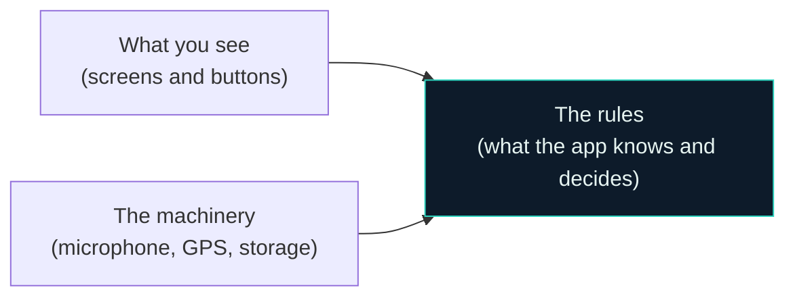
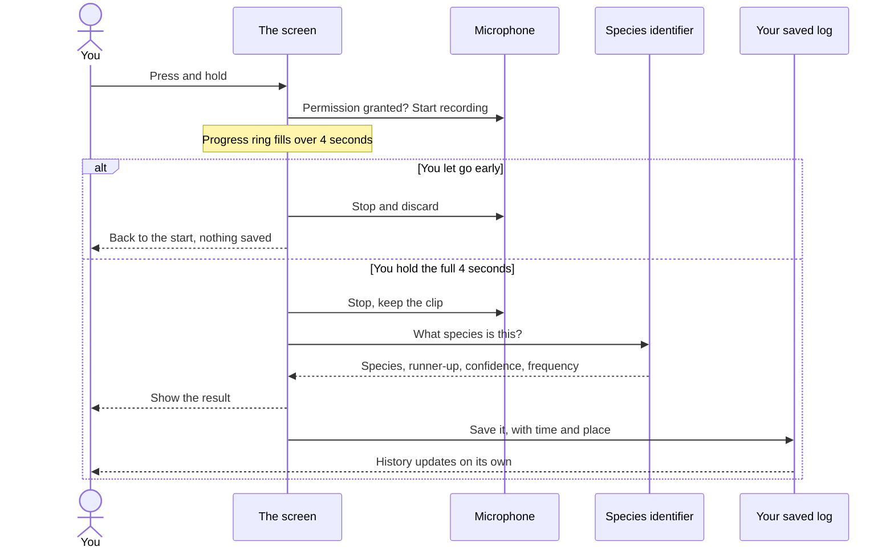

# How MozzID Is Built

This document explains how the app is put together, written for people who do
not write software. There is a short glossary at the end for any term that
cannot be avoided.

If you are a developer looking for exact file paths, models, and design values,
read `PORTING_SPEC.md` instead. This document is the plain-language tour.

---

## 1. What the app does

You hear a mosquito. You press and hold a button for about four seconds. The
phone listens to the sound of its wings, works out which species it most likely
is, and tells you what disease that species can carry. It saves the result with
the time and place, so you build up a personal log and map of where mosquitoes
are showing up.

Two things make this unusual, and they shape every decision below:

**It works with no internet at all.** Not "it works badly offline" — there is no
server involved in the core experience. Everything happens on the phone. This is
deliberate: the app is meant for tropical regions, used at night, often far from
a signal.

**It has to be trustworthy about uncertainty.** The app is making a guess. So it
always shows how confident it is, and always shows the second-most-likely
species too. It never presents a guess as a fact.

---

## 2. The one big idea: three layers

The code is organised into three groups. The rule that makes this work is about
which group is allowed to know about which.

Notice both arrows point inward, and there is no arrow between the outer two.
That is the entire rule.

**The rules layer in the middle** is the heart. It holds the app's knowledge: what
a mosquito species is, what a detection is, how to work out "your most active
hour" from a list of detections. This layer knows nothing about phones. It does
not know what a screen is, what a microphone is, or that Android exists. You
could lift it out and run it on a completely different kind of device.

**The machinery layer** is everything that touches the real world: recording from
the microphone, reading GPS, saving to storage.

**The screens layer** is what you see and touch.

### Why bother with this

Three practical payoffs, and they are the reason the structure is worth the
discipline:

*The important logic can be tested instantly.* Working out "your peak mosquito
hour" is pure reasoning over a list. Because that logic sits in the middle layer
and does not touch a phone, it can be checked in under a second without
installing anything. The app currently has eight such automatic checks that run
on every build.

*The machinery can be replaced without touching anything else.* This matters
enormously for the next point.

*Nothing can quietly become essential.* Because the middle layer cannot refer to
the machinery, no piece of hardware or online service can sneak in and become
something the app depends on. The offline promise is enforced by the structure
itself, not by remembering to keep it.

---

## 3. The two deliberate gaps

Two parts of this app are not finished, and that is intentional. Rather than
leaving holes, each is a clearly defined socket that something can be plugged
into later.

### The species identifier

The part that actually recognises a mosquito from its wingbeat is a machine
learning model, and it does not exist yet. Building and training it is a large
separate effort.

So the app defines exactly what such a model must do — take a sound clip, return
a most-likely species, a runner-up, a confidence score, and a measured wingbeat
frequency — and today plugs in a **stand-in** that returns realistic-looking
results without listening to anything.

This is not a shortcut. It means everything around the model is genuinely
finished and testable now: the recording, the timing, the result display, the
saving, the history. When the real model is ready it plugs into the same socket
and one line of the app changes. No screens are rewritten.

The stand-in is honest about being a stand-in: it waits 1.7 seconds to imitate
real thinking time, and returns confidence between 78 and 94 percent with a
plausible wingbeat frequency for whichever species it picked.

### The online sync

There is a matching socket for sending detections to a server. Today it is
filled with a piece that deliberately does nothing at all.

This is how the offline promise is kept honest. The app is not "offline capable
with sync bolted on" — it is offline, and sync is an optional extra that can be
plugged in without the rest of the app noticing. If the online piece is missing
or broken, the app carries on completely unaffected, because the do-nothing
version is what it expects by default.

---

## 4. What happens when you press record

Three details in there are worth pulling out, because each is a deliberate
choice rather than an accident.

**Letting go early cancels everything.** A short clip is a bad clip, and a bad
clip produces a confident-looking wrong answer. So a partial recording is thrown
away rather than analysed.

**Location is best-effort, never required.** The app asks for your location to
put the detection on your map. If you refuse, or GPS is switched off, or it is
slow, the detection still saves with no coordinates attached. Losing a location
is a small loss. Losing the detection entirely because location failed would be
a real one, so the app is built so that cannot happen.

**The history updates itself.** Nothing tells the history screen to refresh. It
watches the stored data continuously, so the moment a detection is saved it
appears. There is no way for the list to drift out of date with what is actually
stored.

---

## 5. Where information is kept

Everything lives in one small database file on the phone. Nothing leaves the
device.

There are exactly two collections in it:

**Your detections** — one row per identification: which species, how confident,
the measured frequency, when, and where if location was available.

**Your settings** — language, light or dark, accent colour, and your on/off
preferences.

Settings are stored sparsely, which is a small decision with a useful
consequence: a preference is only written down once you actually change it, and
anything not written down falls back to a sensible default. That means new
settings can be added in future without disturbing anyone's existing data.

On first install the app seeds a handful of example detections around Jakarta,
so the history and map have something to show before you have recorded anything.

---

## 6. How the look and feel is controlled

No colour, font, or size is written directly into any screen. Every screen asks
a central source for them.

This is what makes the appearance settings work. When you change the accent
colour, you are changing one value in one place, and the entire app recolours
immediately because every screen was already asking that one place. Light and
dark mode work the same way. There are four accent colours and both brightness
modes, and the whole app follows any combination.

### Risk is never shown by colour alone

This one is a firm rule rather than a preference.

Each species carries a risk level, and each level always appears three ways at
once: a distinct shape, a written label, and a colour.

| Risk level | Shape | Written as |
|---|---|---|
| High | Triangle | "High risk" |
| Moderate | Circle | "Moderate risk" |
| Low | Square | "Low risk" |

Roughly one in twelve men has some form of colour blindness. If risk were shown
only as red or amber, the single most important thing on the screen would be
invisible to them. The shape and the words carry the meaning on their own; the
colour only reinforces it.

The risk colours also deliberately stay fixed when you change the accent colour,
so risk never changes appearance based on a cosmetic preference.

---

## 7. Languages

The app is fully available in English and Indonesian. Every piece of text is
stored in both languages, and the two lists are generated from a single source
so neither can drift out of sync with the other.

You can change language inside the app, and it takes effect immediately without
restarting. Your choice overrides whatever language the phone is set to, because
the person using the app is not always the person who set up the phone.

---

## 8. What is actually built today

Being straightforward about this matters more than a tidy status table.

**Working and verified:**

- The three-layer structure, with the middle layer confirmed to have no phone-specific dependencies
- Both sockets, with the stand-in identifier and the do-nothing sync in place
- Real microphone recording and real GPS
- The full press-and-hold sequence: record, analyse, show, save
- Storage, including the example data
- The complete colour, font, and spacing system, and all text in both languages
- Eight automatic checks covering the log filtering and statistics logic

**Not built yet:**

- The real species identification model
- Optional online sync
- Most of the finished screens. What exists today is a bare working screen that
  proves the whole sequence functions end to end. The designed screens —
  introduction, the full record screen with its animated mascot, the history map,
  settings — are the next major piece of work.

**Not yet confirmed on real hardware.** The app builds and packages correctly,
but has not yet been run on a physical phone. The microphone, GPS, and language
switching are the parts most likely to behave differently on a real device than
they do on a development machine, so treat those as written but unproven.

---

## 9. Glossary

**Layer** — a group of code with a defined job and defined limits on what it is
allowed to know about.

**Seam or socket** — a written-down description of what a replaceable part must
do, so different versions can be swapped in without disturbing anything around
them.

**Stand-in** — a placeholder that behaves like the real thing from the outside,
so everything around it can be finished and tested before the real thing exists.

**On-device** — happening on the phone itself, with nothing sent anywhere.

**Wingbeat frequency** — how many times per second a mosquito beats its wings,
measured in Hertz. Different species beat at different rates, which is what
makes identification by sound possible at all.

**Confidence** — how sure the app is, from 0 to 100. Always shown, because a
guess presented as a certainty is worse than no guess.
